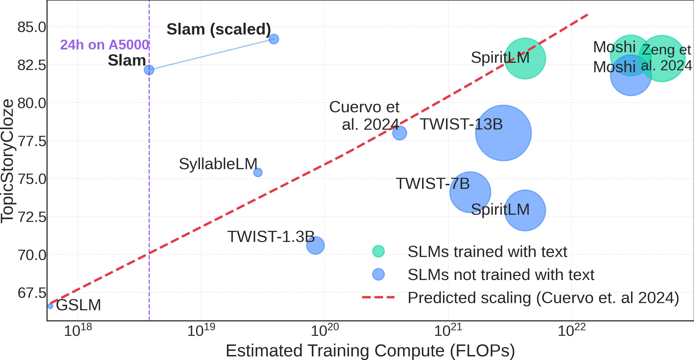

# SlamKit
The official code for ["_Slamming_: Training a Speech Language Model on One GPU in a Day"](https://arxiv.org/abs/2502.15814).

<p align="center">
    🌐 <a href="https://pages.cs.huji.ac.il/adiyoss-lab/slamming/" target="_blank">Project</a> | 📃 <a href="https://arxiv.org/abs/2502.15814" target="_blank">Paper</a> | 🤗 <a href="https://huggingface.co/collections/slprl/slam-67b58a61b57083505c8876b2" target="_blank">Models & Datasets</a><br>
</p>




💻 We also plan to expand this repository to include more features, if you would like
to develop this open source and contribute see [Contributing](#contributing).

## Installation
The code was tested with `python=3.12`, but should also work with other python versions. Install as below:
```
cd slamkit
pip install -e .
```

Note that this installs minimal requirements, and some features may require additional installation.
For instance, the Vocoder is based on textlesslib [`fairseq`](https://github.com/facebookresearch/textlesslib) so see
their installation guide for more details if you plan to use it.

## Usage
❗If you are only interested in evaluating or generating with a pre-trained SpeechLM, you can skip
straight to the [Eval](#eval) section.

Our pacakge is built with four main scripts, corresponding to four main stages: [extract_features.py](https://github.com/slp-rl/slamkit/blob/main/cli/extract_features.py), [prepare_tokens.py](https://github.com/slp-rl/slamkit/blob/main/cli/prepare_tokens.py), [train.py](https://github.com/slp-rl/slamkit/blob/main/cli/train.py), [eval.py](https://github.com/slp-rl/slamkit/blob/main/cli/eval.py). 
The core idea is to separate certain logics to share pre-computed representations as much as possible thus save time. 
We explain about each part more below. 

Our codebase uses [Hydra](https://hydra.cc) to manage configurations, we suggest that you read a bit about it if you are unfamiliar with it.

## Pre-training

We explain the run commands with a demonstration data sample provided located at [example_data/audio](https://github.com/slp-rl/slamkit/tree/main/example_data) that way you can assert that your output is as expected. 

### Extract features
This script takes audio files and outputs a file with discrete token data, using a pre-trained speech tokeniser. 
The representation operate at Tokeniser level to guarantee consistency across different steps, however, it truly only 
depends on the feature extractor thus can be shared between different tokenisers over the same features 
(such as text-interleaving or units only over the same Hubert). 

The output of this script can be directly used for the next phase, which is tokeniser specific.
An example of running it:
```
python cli/extract_features.py data_path=example_data/audio ext=flac out_path=example_data/features.jsonl batch_size=16 tokeniser=unit_hubert_25 tokeniser.feature_extractor.compile=true num_workers=4
```
This will output a file that is similar to [example_data/features.jsonl](https://github.com/slp-rl/slamkit/blob/main/example_data/features.jsonl), usually up to the order of the files or the file_name.

We define the `data_path`(should be a dir), the `ext` (extension for audio), the `tokeniser` which is a config file in this case [config/tokeniser/unit_hubert_25.yaml](https://github.com/slp-rl/slamkit/blob/main/config/tokeniser/unit_hubert_25.yaml).

⚠️ Note! The tokenise script operates over entire audio files without splitting them, which can consume a lot of memory for very large audio files (30 minutes) thus we recommend to run Voice activity detection (VAD) on the files before in order to split them.

❗The audio samples are sorted by length in decreasing order to minimise padding, and fail early for out of memory. You are able to subset the dataset and taking only part of the files with `data_skip=10 data_take=500`

❗using `tokeniser.feature_extractor.compile=true` runs `torch.compile` on the tokeniser which can improve runtime but incur latency in initialisng the model so probably best not to use when debugging.

### Prepare tokens
This script takes the output of `extract_features.py` and prepares the tokens as a string representation for 
training. This script is already dependent on the tokeniser and the tokeniser specific features, such as text.

```
python cli/prepare_tokens.py data_path=example_data/features.jsonl out_path=example_data/tokens
```
Again this command should create a file similar to [example_data/tokens.jsonl](https://github.com/slp-rl/slamkit/blob/main/example_data/tokens.jsonl)

This command can also create different tokens for different training regimes. e.g. You can use `tokeniser=interleaved_hubert_25` to create an text-speech interleaved dataset.

❗ some training regimes might need aditional metadata, such as aligned text.

### Pre-Train
This script takes pre-tokenised data (as output from `prepare_tokens.py`) and trains a speech language model over the tokens.

An example of running it:
```bash
python cli/train.py data.train_path=example_data/tokens.jsonl data.val_path=example_data/tokens.jsonl tokeniser=unit_hubert_25 training_args.num_train_epochs=1 training_args.per_device_train_batch_size=16 training_args.gradient_accumulation_steps=4 data.num_proc=32 logger=wandb logger.entity=<Entity> logger.project=<Project> training_args.output_dir=../outputs/baseline
```

❗Note that the `train_path` and `val_path` can be a specific file or a glob path for several files like in the example above. Use this to merge shards or datasets!

❗Note that `training_args` is arguments to a HuggingFace🤗 model so you can pass any argument [it expects](https://huggingface.co/docs/transformers/v4.48.1/en/main_classes/trainer#transformers.TrainingArguments), for instance add `+dataloader_num_workers=8` to use 8 workers!

🧪 We give an example of logging results to Weights & Biases but you could remove this and results will be printed locally

## Preference Alignment

for the preferemce alignment portion we provide two scripts: [preference_alignment_feature_extractor.py](https://github.com/gallilmaimon/slm_eval/blob/055a4ae5d7ecffc5c94259bc85ed616b6bd21cfc/cli/preference_alignment_feature_extractor.py), [preference_alignment_train.py](https://github.com/gallilmaimon/slm_eval/blob/055a4ae5d7ecffc5c94259bc85ed616b6bd21cfc/cli/preference_alignment_train.py). for now there is no equvalent to prepare tokens since we don't support preference alignment for text-speech interleaved models. This features will come in the future.

### Extract features

The script works in a similar way to the original version, but expects input of a different type. instead of a folder with audio files in it we expect a `jsonl` with the format
```
{"prompt_path" : "path/to/prompt.wav", "chosen_path" : "path/to/chosen.wav", "rejected_path" : "path/to/other.wav"}
```

and it will output
```
{"prompt_path" : "path/to/prompt.wav", "chosen_path" : "path/to/chosen.wav", "rejected_path" : "path/to/other.wav", "prompt" : {"audio_repr": <audio_repr>}, "chosen" : {"audio_repr": <audio_repr>}, "rejected" : {"audio_repr": <audio_repr>}}
```

An example command:
```
python cli/preference_alignment_feature_extractor.py data_path=preference_data.jsonl out_path=preference_data_features.jsonl
```

❗ Note that this script feature extracts the prompt,chosen,rejeced using one forward pass (so if batch_size=8, the model will do a forward pass on 24 files). choose batch size accordingly.

### Preference Alignment Train

the script again works in similar way to [Pre-training](#pre-train). The only difference is that you will usually start with a pretrained model using the argument `model.pretrained_model=<>` where path can be either a path to a checkpoint or a model in hugging face such as [slprl/slam](https://huggingface.co/slprl/slam). 

For now we only support [DPO](https://huggingface.co/docs/trl/main/en/dpo_trainer), other types may be added in the future.


### Eval
This script is used to evaluate metrics of your awesomely trained SpeechLM. 
We currently support modelling metrics: sWUGGY, sBLIMP, Spoken StoryCloze and [SALMon🍣](https://github.com/slp-rl/salmon).
We also support generating continuations, and generative metrics: GenPPL and Auto-BLEU.

An example of running it:
```bash
python cli/eval.py tokeniser=unit_hubert_25 metric=tstorycloze metric.data_path=<TSC_PATH> batch_size=32 model.pretrained_model=<TRAINED_MODEL_PATH>
```


❗Note that the `model.pretrained_model` needs to point to a folder of a specific step within the output folder `training_args.output_dir` from training or a model from hf.

❗Note that we currently only support running one metric with each run of `eval.py`. You can use [hydra multirun](https://hydra.cc/docs/tutorials/basic/running_your_app/multi-run/) to run them in sucession or in parallel

## Results
We provide some results for our pre-trained models, compared to other SLMs.

| Model                                     | GPUs    | Params | Num Tokens    | sBLIMP ↑  | sStoryCloze ↑ | tStoryCloze ↑ | GenPPL ↓ | Auto-BLEU ↓ |
|-------------------------------------------|---------|--------|---------------|-----------|---------------|---------------|----------|-------------|
| **Speech only pre-training**              |         |        |               |           |               |               |          |             |
| GSLM                                      | 8×V100  | 100M   | 1B            | 54.2      | 53.3          | 66.6          | —        | —           |
| SyllableLM                                | 4×A40   | 300M   | 16B           | 63.7      | —             | 75.4          | —        | —           |
| TWIST-350M                                | 8×V100  | 305M   | 10.8B         | 56.2      | —             | —             | 137.3    | 3.46        |
| TWIST-1.3B                                | 32×V100 | 1B     | 10.8B         | 57.0      | 52.4          | 70.6          | 131.8    | 3.20        |
| TWIST-7B                                  | 32×V100 | 7B     | 36B           | 59.0      | 55.3          | 74.1          | 93.74    | 3.06        |
| TWIST-13B                                 | 32×V100 | 13B    | 36B           | 59.2      | 55.4          | 76.4          | —        | —           |
| Scaled Optimal                            | —       | 823M   | 82B           | **61.3**  | 56.7          | 78.0          | —        | —           |
| Moshi                                     | ?×H100  | 7B     | ?             | 58.9      | **58.7**      | **81.8**      | —        | —           |
| SpiritLM                                  | 64×A100 | 7B     | 100B          | 58.0      | 54.8          | 72.9          | —        | —           |
| **With text / preference optimization**   |         |        |               |           |               |               |          |             |
| Scaling Interleaving                      | —       | 9B     | ~1T           | —         | **62.4**      | 82.9          | —        | —           |
| Moshi                                     | ?×H100  | 7B     | ~720B         | 58.8      | 60.8          | 83.0          | —        | —           |
| SpiritLM                                  | 64×A100 | 7B     | 100B          | 58.3      | 61.0          | 82.9          | —        | —           |
| AlignSLM-1.3B                             | 64×A100 | 1B     | 10.8B + ~158B | 59.8      | 55.0          | 80.0          | —        | —           |
| AlignSLM-7B                               | 64×A100 | 7B     | 36B + ~158B   | **62.3**  | 61.1          | **86.8**      | —        | —           |
| **Ours (_Slam_)**                         |         |        |               |           |               |               |          |             |
| _Slam_ (-DPO)                             | 2×A100  | 358M   | 16.7B         | 58.53     | 58.15         | 80.71         | 67.3     | 3.25        |
| _Slam_                                    | 1×A5000 | 358M   | 1.4B + 5M     | 58.86     | 58.04         | 82.04         | 62.8     | 3.88        |
| _Slam_ (scaled)                           | 2×A100  | 358M   | 16.7B + 9M    | **61.11** | **61.30**     | **84.18**     | **46.6** | 3.75        |

## SlamKit library
You can also use `slamkit` as a library to build your own projects without using our scripts, e.g. if you want to use our pretrained [slam](https://huggingface.co/slprl/slam) you can use the following lines of code

```python
from slamkit.model import UnitLM
model = UnitLM.from_pretrained("slprl/slam")
```

Since this library is built upon huggingface🤗, most features of hf will work out of the box. such as pushing to the hub:
`model.push_to_hub('<entity>/great_model')`

## Contributing
We welcome contributions to this repository. Want to add support for new tokenisers? 
Add support for even more efficient implementations? If you are interested in building this open source 
project - open an Issue, and one of the maintainers will guide you in opening a PR!

## Citation
If you found this repository useful, please cite our work:
```bibtex
@misc{maimon2025slamming,
      title={Slamming: Training a Speech Language Model on One GPU in a Day}, 
      author={Gallil Maimon and Avishai Elmakies and Yossi Adi},
      year={2025},
      eprint={2502.15814},
      archivePrefix={arXiv},
      primaryClass={cs.LG},
      url={https://arxiv.org/abs/2502.15814}, 
}
```
