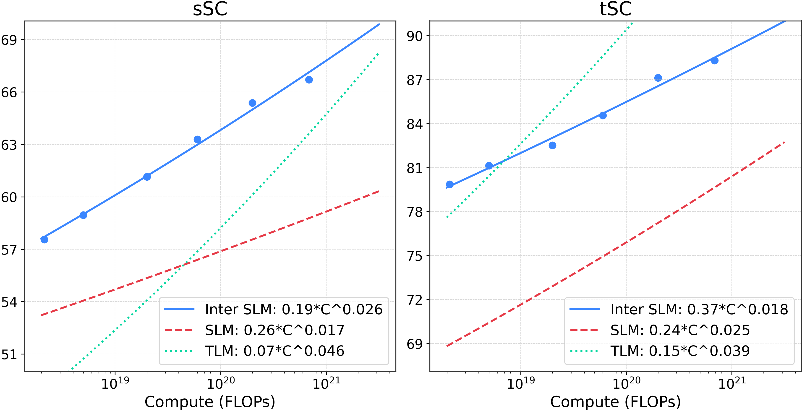

# SIMS
The official code for "Scaling Analysis of Interleaved Speech-Text Language Models"
<p align="center">
    🌐 <a href="https://pages.cs.huji.ac.il/adiyoss-lab/sims/" target="_blank">Project</a> | 📃 <a href="https://arxiv.org/abs/2504.02398" target="_blank">Paper</a> | 🤗 <a href="https://huggingface.co/collections/slprl/sims-67ecea7521ff9740ff456c5e" target="_blank">Models & Datasets</a><br>
</p>




## Installation & Usage
Please follow the instructions in the base of the directory.

## Eval
An example of running generation given a prompt, using a pretrained vocoder:
```bash
python cli/eval.py tokeniser=interleaved_hubert_25 metric=generate batch_size=32 model.pretrained_model=slprl/SIMS-Llama3.2-3B metric.data_path=/some/path/*.wav vocoder=vocoder_hubert_25
# then, find generated files at `generated/`.
```

Examples of running cross modal generation.

Input speech - output text:
```bash
python cli/eval.py metric=cm_generate tokeniser=interleaved_hubert_25 model.pretrained_model=slprl/SIMS-Llama3.2-3B \
metric.prompt_modality=SPEECH metric.cont_modality=TEXT \
tokeniser.params.text_tokeniser_path=meta-llama/Llama-3.2-1B metric.data_path=/path/to/*.wav vocoder=vocoder_hubert_25
```

Input text (single line txt file for each prompt) - output speech:
```bash
python cli/eval.py metric=cm_generate tokeniser=interleaved_hubert_25 model.pretrained_model=slprl/SIMS-Llama3.2-3B \
metric.prompt_modality=TEXT metric.cont_modality=SPEECH \
tokeniser.params.text_tokeniser_path=meta-llama/Llama-3.2-1B metric.data_path=/path/to/*.txt vocoder=vocoder_hubert_25
```

An example of running a modelling metric, specifically Topic-StoryCloze:
```bash
python cli/eval.py metric=tstorycloze tokeniser=interleaved_hubert_25 model.pretrained_model=slprl/SIMS-7B tokeniser.params.text_tokeniser_path=Qwen/Qwen2.5-0.5B reference_path=<DATA_PATH>
```


## Citation
If you use this work, please cite our paper:
```bibtex
@misc{maimon2025scaling,
      title={Scaling Analysis of Interleaved Speech-Text Language Models}, 
      author={Gallil Maimon and Michael Hassid and Amit Roth and Yossi Adi},
      year={2025},
      eprint={2504.02398},
      archivePrefix={arXiv},
      primaryClass={cs.CL},
      url={https://arxiv.org/abs/2504.02398}, 
}
```
